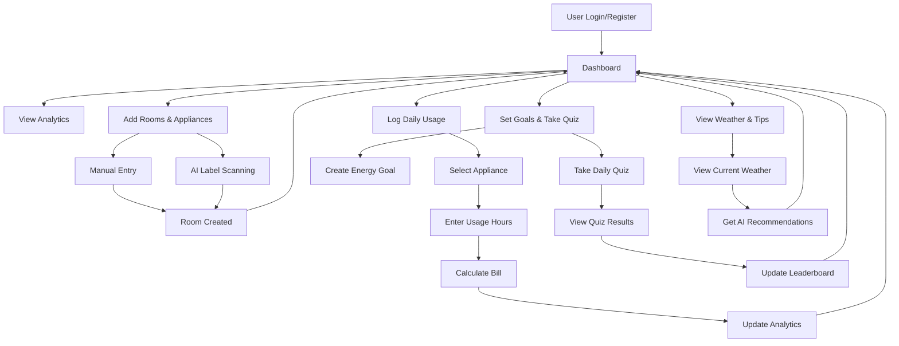

# WattWise - Smart Energy Management Platform

## Project Overview

WattWise is a comprehensive smart energy management platform designed to help users in Goa track their electricity consumption, set energy goals, and reduce their electricity bills through intelligent recommendations and gamification features.

## 🌟 Key Features

### 1. **Multilingual Support**
- **Languages Supported**: English, Hindi, Marathi, Konkani
- **Dynamic Language Switching**: Real-time language change without page reload
- **Comprehensive Translation**: All UI elements, forms, and content translated
- **Cultural Adaptation**: Region-specific content and pricing

### 2. **Smart Dashboard**
- **Real-time Analytics**: Weekly usage tracking, monthly savings calculation
- **Visual Charts**: Interactive usage graphs and consumption patterns
- **Bill Comparison**: Previous vs current month bill analysis
- **Top Consumers**: Identify highest energy-consuming appliances

### 3. **Room & Appliance Management**
- **Dual Entry Methods**:
  - Manual entry with specifications
  - AI-powered energy label scanning (Gemini AI)
- **Room Organization**: Categorize appliances by rooms
- **Smart Categorization**: Pre-defined appliance categories
- **Usage Tracking**: Historical consumption data

### 4. **Intelligent Usage Logging**
- **Daily Logging**: Quick appliance usage entry
- **Instant Calculations**: Real-time bill estimates
- **Goa Tariff Integration**: Accurate cost calculations using official rates
- **Usage History**: Track consumption patterns over time

### 5. **Goal Setting & Gamification**
- **Energy Goals**: Set and track reduction targets
- **Daily Quiz System**: 
  - Daily knowledge quiz with energy tips
  - Streak tracking and scoring
  - One attempt per day limitation
  - Quiz results stored in user profile
- **Leaderboard**: Community competition based on savings and quiz scores
- **Achievement System**: Progress tracking and rewards

### 6. **Weather Integration**
- **Real-time Weather**: Current conditions and forecasts
- **AI Energy Tips**: Weather-based energy saving recommendations
- **Location Services**: Automatic location detection
- **Smart Suggestions**: Contextual advice based on weather patterns

### 7. **Tariff Information System**
- **Interactive Tariff Calculator**: Calculate bills for different consumption levels
- **User Manual**: Complete guide on platform usage
- **Rate Information**: Current Goa electricity rates
- **Usage Guidelines**: Best practices for energy saving

### 8. **Advanced AI Features**
- **Smart Chatbot**: 24/7 energy consultation
- **Bill Estimation**: Predictive billing based on usage patterns
- **Energy Recommendations**: Personalized saving suggestions
- **Pattern Analysis**: Consumption trend identification

## 🏗️ Technical Architecture

### Frontend (React/TypeScript)
```
├── src/
│   ├── components/          # Reusable UI components
│   │   ├── ui/             # Base UI components (Card, Button, Input)
│   │   ├── DailyStreak.tsx # Daily streak display
│   │   ├── LanguageSelector.tsx # Language switching
│   │   ├── TariffInfoModal.tsx # Tariff calculator
│   │   ├── WeatherWidget.tsx # Weather display
│   │   └── SmartEnergyChatbot.tsx # AI chatbot
│   ├── pages/              # Main application pages
│   │   ├── Dashboard.tsx   # Main dashboard
│   │   ├── AddRoom.tsx     # Room management
│   │   ├── LogUsage.tsx    # Usage logging
│   │   └── SetGoals.tsx    # Goal setting & quiz
│   ├── services/           # API and external services
│   │   ├── api.ts          # Backend API integration
│   │   └── weatherService.ts # Weather API integration
│   ├── utils/              # Utility functions
│   │   └── translations.tsx # Multilingual system
│   └── lib/                # Configuration and utilities
```

### Backend (Python/FastAPI)
```
├── app/
│   ├── main.py             # Application entry point
│   ├── models/             # Database models
│   │   ├── user.py         # User management
│   │   ├── room.py         # Room data
│   │   ├── appliance.py    # Appliance information
│   │   ├── usage.py        # Usage tracking
│   │   ├── goal.py         # Goal management
│   │   └── quiz.py         # Quiz system
│   ├── routers/            # API endpoints
│   │   ├── auth.py         # Authentication
│   │   ├── energy.py       # Energy tracking
│   │   ├── goals.py        # Goal management
│   │   └── quiz.py         # Quiz functionality
│   ├── services/           # Business logic
│   │   ├── tariff.py       # Tariff calculations
│   │   ├── ai_service.py   # AI integrations
│   │   └── analytics.py    # Data analysis
│   └── database/           # Database configuration
```

## 🔄 User Flow Diagram



## 🌐 API Integration

### External APIs
1. **WeatherAPI.com**
   - Real-time weather data
   - Location-based forecasts
   - API Key: `bd07809d4c38405dbf421418252709`

2. **OpenRouter AI**
   - AI-powered recommendations
   - Natural language processing
   - Model: `meta-llama/llama-3.1-8b-instruct:free`
   - API Key: `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`

3. **Gemini AI** (Future Integration)
   - Energy label scanning
   - Image recognition for appliances

### Internal API Endpoints
```
Authentication:
POST /auth/register     # User registration
POST /auth/login        # User login
GET  /auth/me          # Get current user

Energy Management:
GET    /energy/rooms                 # Get user rooms
POST   /energy/rooms                 # Create room
PUT    /energy/rooms/{id}           # Update room
DELETE /energy/rooms/{id}           # Delete room
GET    /energy/rooms/{id}/appliances # Get room appliances
POST   /energy/appliances           # Add appliance
PUT    /energy/appliances/{id}      # Update appliance
DELETE /energy/appliances/{id}      # Delete appliance

Usage Tracking:
POST /energy/usage               # Log usage
GET  /energy/usage/history      # Get usage history
GET  /energy/analytics/dashboard # Get dashboard analytics

Goals & Quiz:
GET  /goals                     # Get user goals
POST /goals                     # Create goal
PUT  /goals/{id}               # Update goal
GET  /quiz/daily               # Get daily quiz
POST /quiz/submit              # Submit quiz answers
GET  /leaderboard              # Get leaderboard

Weather & AI:
GET  /weather/current          # Get current weather
POST /ai/recommendations       # Get AI recommendations
```

## 💾 Database Schema

### User Table
```sql
users:
  - id (PRIMARY KEY)
  - username (UNIQUE)
  - email (UNIQUE)
  - password_hash
  - is_active
  - created_at
  - previous_month_bill
  - preferred_language
  - quiz_score
  - quiz_streak
```

### Room & Appliance Tables
```sql
rooms:
  - id (PRIMARY KEY)
  - name
  - user_id (FOREIGN KEY)
  - created_at

appliances:
  - id (PRIMARY KEY)
  - name
  - category
  - wattage
  - brand
  - model
  - room_id (FOREIGN KEY)
  - created_at
```

### Usage & Goals Tables
```sql
usage_logs:
  - id (PRIMARY KEY)
  - appliance_id (FOREIGN KEY)
  - date
  - hours_used
  - kwh_consumed
  - cost_calculated

goals:
  - id (PRIMARY KEY)
  - user_id (FOREIGN KEY)
  - title
  - target_value
  - current_value
  - deadline
  - status

quiz_attempts:
  - id (PRIMARY KEY)
  - user_id (FOREIGN KEY)
  - date
  - score
  - total_questions
  - answers
```

## 🎯 Key Algorithms

### 1. Tariff Calculation (Goa Rates)
```python
def calculate_goa_tariff(units_consumed):
    slabs = [
        (0, 30, 2.95),      # First 30 units
        (30, 60, 3.70),     # Next 30 units
        (60, 120, 4.80),    # Next 60 units
        (120, 300, 6.75),   # Next 180 units
        (300, float('inf'), 7.40)  # Above 300 units
    ]
    
    total_cost = 0
    remaining_units = units_consumed
    
    for min_units, max_units, rate in slabs:
        if remaining_units <= 0:
            break
        
        slab_units = min(remaining_units, max_units - min_units)
        slab_cost = slab_units * rate
        total_cost += slab_cost
        remaining_units -= slab_units
    
    return total_cost + 25  # Fixed charge
```

### 2. Energy Consumption Calculation
```python
def calculate_energy_consumption(wattage, hours_used):
    kwh = (wattage * hours_used) / 1000
    return kwh

def estimate_monthly_cost(daily_kwh, days_in_month=30):
    monthly_kwh = daily_kwh * days_in_month
    return calculate_goa_tariff(monthly_kwh)
```

### 3. Leaderboard Scoring
```python
def calculate_user_score(user_data):
    savings_score = (user_data.savings / user_data.previous_bill) * 50
    quiz_score = (user_data.quiz_score / 100) * 30
    streak_score = min(user_data.quiz_streak * 2, 20)
    
    total_score = savings_score + quiz_score + streak_score
    return min(total_score, 100)
```

## 🌟 Innovation Highlights

### 1. **Smart Translation System**
- Context-aware translations
- Real-time language switching
- Cultural adaptation for local users

### 2. **Gamified Learning**
- Daily energy quiz with educational content
- Streak tracking to encourage consistency
- Community leaderboard for engagement

### 3. **Weather-AI Integration**
- Weather-based energy recommendations
- Contextual tips using AI
- Location-aware suggestions

### 4. **Dual-Input Flexibility**
- Manual appliance entry for tech-savvy users
- AI image recognition for easy onboarding
- Flexible data collection methods

### 5. **Real-time Analytics**
- Live usage tracking
- Instant bill calculations
- Predictive analytics for future consumption

## 🚀 Deployment & Scalability

### Development Environment
```bash
# Frontend (React/TypeScript)
npm install
npm start  # Runs on http://localhost:3000

# Backend (Python/FastAPI)
pip install -r requirements.txt
uvicorn app.main:app --reload  # Runs on http://localhost:8000
```

### Production Considerations
1. **Database**: MongoDB for flexible document storage
2. **Caching**: Redis for session management and frequent queries
3. **CDN**: Static asset delivery for better performance
4. **Load Balancing**: Multiple backend instances for scalability
5. **Monitoring**: Real-time application monitoring and logging

## 📊 Impact & Benefits

### For Users
- **Cost Savings**: 15-30% reduction in electricity bills
- **Awareness**: Better understanding of energy consumption patterns
- **Engagement**: Gamified approach to energy conservation
- **Accessibility**: Multilingual support for diverse user base

### For Community
- **Environmental Impact**: Reduced energy consumption
- **Education**: Increased awareness about energy conservation
- **Competition**: Healthy competition through leaderboards
- **Cultural Inclusion**: Support for local languages

## 🔮 Future Enhancements

1. **IoT Integration**: Smart meter connectivity
2. **Solar Panel Integration**: Renewable energy tracking
3. **Machine Learning**: Advanced consumption prediction
4. **Mobile App**: Native mobile applications
5. **Social Features**: Energy saving challenges and groups
6. **Government Integration**: Subsidy and rebate tracking
7. **Advanced AI**: Computer vision for appliance detection
8. **Energy Trading**: Peer-to-peer energy sharing platform

## 🏆 Competitive Advantages

1. **Local Focus**: Specifically designed for Goa's tariff structure
2. **Multilingual**: Supports local languages for better adoption
3. **Gamification**: Unique approach to energy conservation
4. **AI Integration**: Modern AI features for better user experience
5. **Comprehensive**: All-in-one platform for energy management
6. **User-Friendly**: Intuitive interface with dual input methods

## 📈 Success Metrics

- **User Engagement**: Daily active users, session duration
- **Energy Savings**: Average reduction in user bills
- **Quiz Participation**: Daily quiz completion rates
- **Community Growth**: User registration and retention rates
- **Language Adoption**: Usage distribution across languages
- **Feature Utilization**: Most used features and user flow patterns

---

**WattWise** represents the future of energy management - combining technology, gamification, and local adaptation to create a truly impactful solution for energy conservation in Goa and beyond.